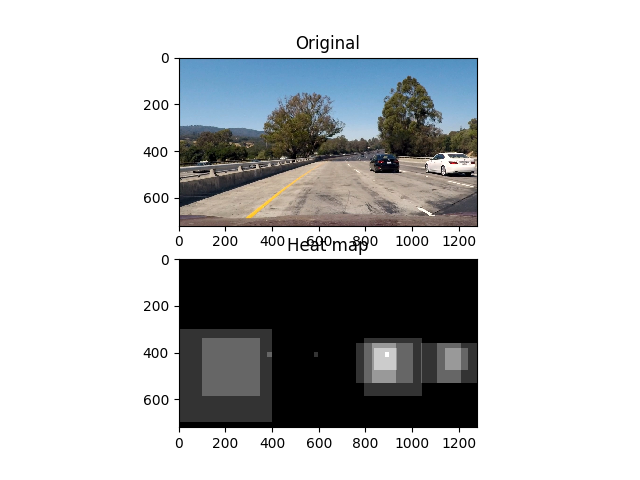

##Vehicle Detection and Tracking Writeup 

## [Rubric Points](https://review.udacity.com/#!/rubrics/513/view)
###Here I will consider the rubric points individually and describe how I addressed each point in my implementation.  

---
###Writeup / README

####1. Provide a Writeup / README that includes all the rubric points and how you addressed each one.  You can submit your writeup as markdown or pdf.  [Here](https://github.com/udacity/CarND-Vehicle-Detection/blob/master/writeup_template.md) is a template writeup for this project you can use as a guide and a starting point.  

You're reading it!

###Histogram of Oriented Gradients (HOG)

####1. Explain how (and identify where in your code) you extracted HOG features from the training images.

The code comprises of the *utils_classifier.py* which deals with creating and training various classifiers, *utils_data_loader.py* which handles loading of training data, *utils_image_processor.py* which handles various image processing functions, and *main_script.py* that binds all the forementioned functions together and execute the main flow of the project.

HOG computation locates in *main_script.py*, line 139 which calls a function *compute_hog()* from the *utils_image_processor.py* with some configurable parameters.

####2. Explain how you settled on your final choice of HOG parameters.

Once training images are loaded, they are resized to 32x32 pixels first, then converted to gray scale, amongst other things (line 79-94 in *main_script.py*). I choose to have 8 pixels per cell, so there are exactly 4 cells in each direction of the image. There are 2 cells per block, for no specific reasons than simply the guts feeling that being able to devide the image into 4 equal cells, and averaging by half the image (2 out of 4 cells) should be enough to minimize the local shadowing effect. Finally there are 12 different orientations for the HOG. Having 12 orientations seems to provide slightly better accuracy than the default 9 but more than 12 doesn't provide any observable gain. See following figures on processing steps to get the HOGs.

- Original images

- Scaled and grayed images

- HOGs of car image

- HOGs of non-car image

####3. Describe how (and identify where in your code) you trained a classifier using your selected HOG features (and color features if you used them).

Starting from line 138-173 in *main_script.py*, the training data is assembled from HOG features and histogram vector of the H color channel (from HLS color space), pre-processed, splited into training and validation sets, standardised and finally used to train some classifiers. Note that the provided raw image datasets were also augmented (flipped left-right) ealier at lines 82 and 89.

An example of the HLS transformation of both car and non-car objects are shown below. Using only the H channel should capture the distinct, usually bright and monotonic color of cars compared to other dull and random colors of the surrounding environments.

I chose to experiment with Support Vector Machine classifiers (SVC and linear SVC), trained at lines 166-173 in *main_script.py*, and also some Neural Network classifiers based on CNN, with 3 CNN layers, max pool, dropout and some FC layers afterward, followed by a typical softmax layer for making binary classification (line 179-200 in *main_script.py*). The inputs to these CNN models are either gray-scaled images, or images of edges from the Canny edge detection algorithm. 

From experimentations, the sklearn's SVC performs the best (99.1 %) and comparable to using CNN on gray images (98.9 - 99.0%), while the linear SVC is the worst (96 %). However the SVC also detects a lot more false positives compared to CNN, thus requiring greater threshold value to be applied to the heatmap (to be discussed later).

###Sliding Window Search

####1. Describe how (and identify where in your code) you implemented a sliding window search.  How did you decide what scales to search and how much to overlap windows?

The sliding window search is implemented in the function *compute_sliding_window()*, at line 203 in *utils_image_processor.py*. This function produces bounding boxes covering the specified x / y at start / stop ranges. The window sizes are also scaled linearly from the far side (at y start - being the farthest from the camera) to the near side (at y stop - being the closest to the camera). You also need to specify the preferred window sizes at the far and near sides too. Any other windows in between will have their sizes linearly scaled between the two. This is to reflect and crop the search boxes to the real-world objects appearing smaller as they are further away.

The overlapping parameter is set to 0.9 from experimentations. Additionally at the final run, there are total of 9 steps for windows in the y axis. This results in a very dense and cluttered overlapping search boxes as shown below. This ensures any car at any distance will be detected in multiple overlapping windows, and stands out better compared to other false positives.

####2. Show some examples of test images to demonstrate how your pipeline is working.  What did you do to optimize the performance of your classifier?

The overall pipeline to process one image is as follows.
- Identify search boxes using sliding window technique discussed earlier.

- For each window, extract image, rescale to 32x32 pixel and convert from RGB to gray scale color. This is similar to what has been discussed in the HOG section. Then append the HOG vector with histogram bins of the H channel of the image. 

- Use Support Vector Machine classifier to detect cars in the windows. For each window with a detected car, increment the corresponding area in the heatmap image by one. 

- Combine the heatmap of the current frame to the last 4 heatmaps from previous frames. Then apply threshold to filter out any false positives, as shown below.

- Draw boxes on the resulting thresholded heatmap around detected objects.

---

### Video Implementation

####1. Provide a link to your final video output.  Your pipeline should perform reasonably well on the entire project video (somewhat wobbly or unstable bounding boxes are ok as long as you are identifying the vehicles most of the time with minimal false positives.)

Here's a [link to my video result](result_video.mp4)

####2. Describe how (and identify where in your code) you implemented some kind of filter for false positives and some method for combining overlapping bounding boxes.

At line 426-447 in *detect_cars_in_image()* function of the *utils_image_processor.py* module, the heatmap of the current frame is produced. It is then combined with past heatmaps and threshold is applied to filter out noises. The resulting thresholded combined heatmap is passed on to sklearn's label() function to isolate groups of pixels corresponding to each label.

### Here are six frames and their corresponding heatmaps:

### Here is the output of `scipy.ndimage.measurements.label()` on the integrated heatmap from all six frames:

(See the next section)

### Here the resulting bounding boxes are drawn onto the last frame in the series:

---

###Discussion

####1. Briefly discuss any problems / issues you faced in your implementation of this project.  Where will your pipeline likely fail?  What could you do to make it more robust?

- I found that I've wasted a lot of time trying to remove false positive detections. Setting thresholds to various values and deciding how many frames from the past should be taken into account when combining heatmaps also helps, but it's not enough. Making threshold to small introduces a lot of noises but all cars are detected. Setting it to be too large removes noises away but also reduces sensitivity of the detection too. 
- Thus the next step I tried is to adjust window sizes to be appropriate for expected objects (cars) at different distance on the horizon (the y position). The further the object is, the bounding box should be smaller too to ensure only cars are detected and not the others. This helps, but noises are still around. It also adds in complexity that when the car is too far away, only a few bounding boxes pick up that car such that the resulting heatmap fails to pass the defined threshold. It seems to suggest I have to make the threshold linearly scale with the y position too, e.g., distant detection should require smaller threshold than closer detection.
- This all seems to get very complicated that I decide the best way to solve this problem is to ensure the classifier detects as few false positives as possible to begin with. Thus I tried increasing the accuracy of the SVC classifiers by adding some color information to it. First with the H-channel histogram which helps increasing the accuracy by a few percent. The S and L channels don't help. Next adding spatial binning for color information. However the latter adds almost a thousand more parameters to the training vector which I think is too much, compared to the size of our datasets. Experimental results also don't show any significant gain in accuracy (decrease actually).
- I also tried with CNN with 3 layers, some FC, dropout, maxpool, etc as usual on the gray images. The accuracy is quite impressive, on the same par with the best SVC with carefully chosen features. It also produces much less false positives too. However it fails to detect the black car at the end of the video, which should have been an easy task. I haven't had time to investigate further why since I need to submit this project before the term ends now. But I suspect there aren't simply enough training data on that angle of the car (back, slightly off to the left side).
- I think the entire flow here is quite sensitive to changes and requires intensive fine tuning. I won't be surprise if it breaks down on other scenes.
- To make it more robust, I will probably go with all CNN solution, with bigger training dataset from all lighting conditions. Car location and speed should also be taken into account, so we can expect where in the next frame that car will likely be. Then we can create search windows customized to that distance with proper sizes to look and update that car's position later, while leaving only broad, sparsely populated search windows in other areas to detect for possible new cars appearing in the scene.

